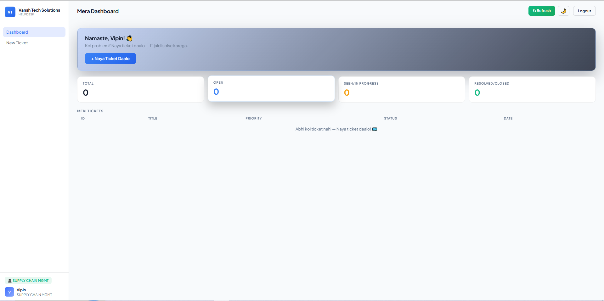
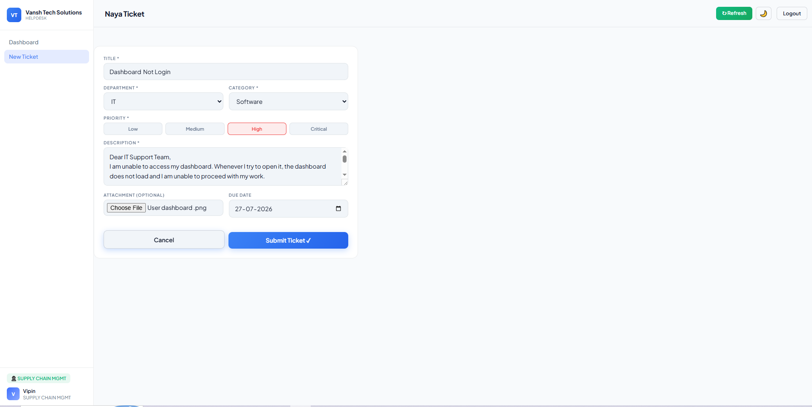
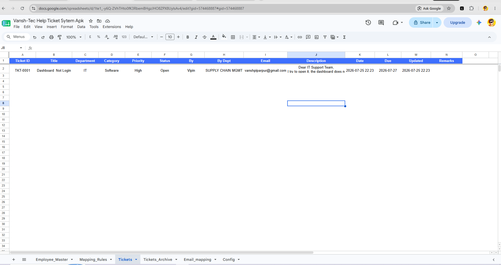

# Help Desk Ticket Management System

A Help Desk / IT-HR support ticketing system built on **Google Apps Script** and **Google Sheets**, with no external database or paid backend.

I built this after facing the problem firsthand at work — support requests were being tracked over WhatsApp and manual Excel sheets, with no clear visibility into ticket status, ownership, or response time. This project is my attempt to solve that with tools that any small team already has access to (a Google account).

This is an active project — I'm continuing to test edge cases, fix issues, and add improvements over time.

---

## Live Demo

🔗 [Try it here](https://script.google.com/macros/s/AKfycbyO4XpFs_w14XdM6XXJCWJWGRNWvUyqX7DC29MAlfUht1G-pZHRXLc7-tugiyNfsn91/exec)

**Demo login:**
- Employee Code: `Vansh-14`
- Password: `1979@@`

> This is a demo environment with test data only — feel free to explore all three roles.

---

## Screenshots

**Employee Dashboard**


**Raising a Ticket**


**Google Sheets as the Backend**


**Login Flow (Demo)**

https://github.com/vansh-sql/helpdesk-ticket-system/blob/main/screenshots/login-demo.mp4

---

## Why I Built This

Most small teams don't have the budget or the need for a full ticketing platform like Zendesk or Freshdesk. But they still need:
- A way to raise and track support requests
- Some visibility into who is responsible for what
- Basic accountability on response times

Google Sheets is something almost every team already uses. So instead of reaching for a traditional database and hosting setup, I built the entire backend on top of it using Google Apps Script.

---

## Features

**Access Control**
- Three roles: Super Admin, Department Staff, and Employee — each with a different dashboard and permission level
- Staff can only view and act on tickets assigned to their department

**Ticketing & SLA**
- Employees can raise tickets with optional file attachments (stored via Google Drive)
- SLA deadlines are calculated automatically based on priority:
  - Critical — 2 hours
  - High — 4 hours
  - Medium — 24 hours
  - Low — 48 hours

**Notifications**
- An HTML email is sent automatically to the relevant department when a ticket is raised

**Security**
- Passwords are hashed using SHA-256 before being stored — they are never saved as plain text
- Key actions (status changes, remarks, new employee onboarding) are logged to a separate `Audit_Logs` sheet

**Analytics**
- Dashboard for Super Admins showing pending vs. SLA-breached tickets by department, using Chart.js
- One-click PDF export of ticket reports using html2pdf.js

**Interface**
- Responsive layout that adapts to mobile screens
- Dark mode toggle
- Client-side search/filtering for employees and tickets

---

## Tech Stack

| Layer | Technology |
|---|---|
| Backend | Google Apps Script (JavaScript, V8 runtime) |
| Data Storage | Google Sheets (used as the primary data store) |
| Frontend | HTML, CSS, Vanilla JavaScript |
| File Storage | Google Drive API |
| Charts | Chart.js |
| PDF Export | html2pdf.js |

There is no traditional backend server or external database here — Google Sheets acts as the data layer, and Apps Script handles the server-side logic, triggers, and email automation.

---

## Project Structure

```
├── Code.gs                          # Backend logic: auth, ticket creation, SLA calculation,
│                                     # sheet setup, server-side functions, HTML rendering
├── EmailTemplate.html                # HTML template used for email notifications
└── screenshots/
    ├── user-dashboard.png
    ├── raise-ticket-form.png
    ├── google-sheets-mapping.png
    └── login-demo.mp4
```

The frontend HTML/CSS/JS is served directly through `Code.gs` using Apps Script's `HtmlService`, so the whole app runs from a single Apps Script project.

---

## How It Works

1. **Login** — Employee credentials are validated against the `Employee_Master` sheet using SHA-256 hash comparison.
2. **Raise a Ticket** — Employee submits a ticket with priority and category; any attached file is uploaded to Google Drive and linked to the ticket.
3. **Routing** — The system looks up the responsible department's email from the `Email_mapping` sheet and calculates the SLA deadline based on priority.
4. **Notification** — An HTML email is sent to the department automatically.
5. **Resolution** — Staff update the ticket status and add remarks; every change is logged to `Audit_Logs`. The employee sees status updates on their dashboard.

---

## Setup / Installation

1. Create a new [Google Apps Script project](https://script.google.com).
2. Copy the contents of `Code.gs` into the script editor.
3. Create a new HTML file named `EmailTemplate` and paste in the contents of `EmailTemplate.html`.
4. Run the `setupSheets()` function once — this will automatically create the required sheets in a linked Google Spreadsheet:
   - `Employee_Master`
   - `Email_mapping`
   - `Tickets_Data`
   - `Archive`
   - `Audit_Logs`
5. Update the `Email_mapping` sheet with your department names and corresponding email addresses.
6. Deploy the project as a **Web App**:
   - Execute as: *Me*
   - Who has access: *Anyone within your organization* (or as needed)
7. Open the deployed web app URL and log in with a user added to `Employee_Master`.

---

## Known Limitations

- No automated test suite yet — testing has been manual so far.
- Google Sheets has row/performance limits, so this is best suited for small to mid-sized teams rather than large-scale enterprise use.
- Currently single-organization; not built for multi-tenant use.

---

## Roadmap

- [ ] Add automated tests for core backend functions
- [ ] Improve error handling for file upload failures
- [ ] Add ticket reassignment/escalation flow
- [ ] Better mobile UX for the analytics dashboard

---

## Feedback

This project is still evolving. If you try it out or read through the code, I'd genuinely appreciate any feedback, bug reports, or suggestions — feel free to open an issue or reach out.
